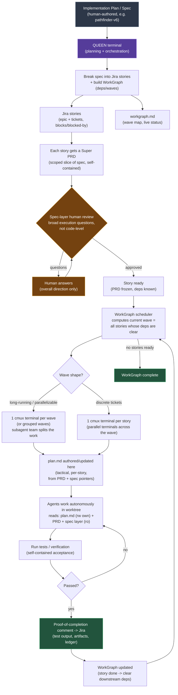

# Queen Orchestration Workflow
_2026-06-09_

## Purpose

Queen turns a human-authored implementation plan into a Jira-visible work graph, then launches autonomous cmux execution without losing continuity.

The key separation is:

- **Spec layer:** the broad implementation plan, read-only during execution.
- **Jira layer:** visual manager board, linked stories, blockers, Super PRDs, proof comments.
- **WorkGraph layer:** `workgraph.md`, waves, lanes, dependencies, live execution status.
- **Story layer:** one ticket, one Super PRD, one tactical `plan.md`, one worktree.
- **Cockpit layer:** Queen terminal plus cmux workspaces.

## Flow



## Operational Contract

1. Queen reads the human spec and drafts Jira stories under the parent/epic.
2. Queen writes compact WorkGraph metadata into each story: wave, lane, blockers, parallel peers, source spec path/section.
3. Jira stores the Super PRD for each story, not the full tactical plan.
4. Spec-layer human review asks broad direction questions only. It should not force Jake into code-level planning.
5. A story is ready when the Super PRD is frozen enough, dependencies are known, repo is known, and size policy allows execution.
6. The scheduler starts the next wave from currently unblocked stories.
7. Missing `plan.md` is not a launch blocker. It is a worker warning: author or update the tactical plan before code changes.
8. Workers read existing continuity by pointer: `workgraph.md`, story/Super PRD, and their own `plan.md` when present.
9. Workers write proof back through Queen/Jira comments after verification.
10. Completed proof clears downstream dependency visibility in WorkGraph status.

## Token Discipline

- Do not paste the whole source spec, Jira transcript, workgraph, or local plan into every worker prompt.
- Startup prompts should carry pointers and compact receipts.
- `agent-queue context <ticket> --brief` is the default worker bootstrap.
- `--standard` is for the Super PRD plus linked work.
- `--deep` is reserved for debugging when the worker truly needs full Jira context.
- `plan.md` is written once per story and edited in place; Jira comments summarize meaningful revisions.

## Current Implementation Direction

Queen supports the discrete-ticket path first:

```bash
agent-queue graph-status AISOL-448
agent-queue execute-wave AISOL-448 --wave 1
agent-queue execute-wave AISOL-448 --wave 1 --start
```

The long-running per-wave team terminal is a future scheduler mode. It should reuse the same WorkGraph and Super-PRD contract rather than introducing a separate orchestration model.
